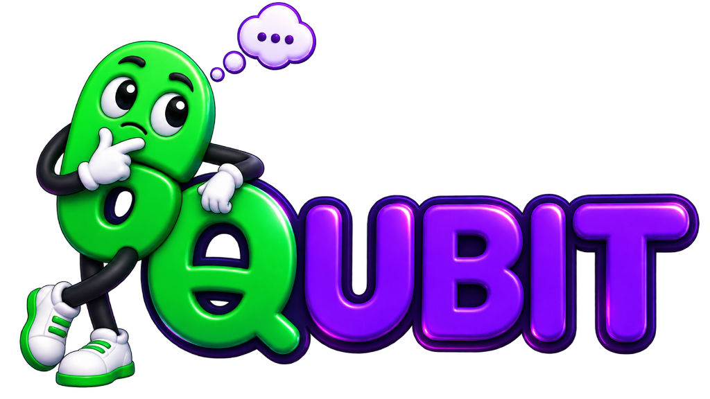

# ⚛️ QubitQuest — AI-Based Interactive Quantum Algorithm Learning Platform

<div align="center">



### 🏆 Smart India Hackathon (SIH) — Problem Statement ID: 26140
**AI-Based Interactive Quantum Algorithm Learning Platform**

[](https://react.dev/)
[](https://vitejs.dev/)
[](https://developer.mozilla.org/en-US/docs/Web/CSS)
[](https://developer.mozilla.org/en-US/docs/Web/API/Web_Speech_API)
[](https://developer.mozilla.org/en-US/docs/Web/API/Web_Audio_API)
[](LICENSE)

**Designed & Architected by Ganesh J (Lead UI/UX Designer & Frontend Architect)**

*An interactive, tactile, gamified quantum learning universe that breaks down complex quantum computing concepts, Dirac notations, quantum gates, circuits, and quantum algorithms through intuitive visual simulations, procedural audio, and AI voice narration.*

---

[🚀 Quick Start](#-getting-started--local-development) •
[🌟 Key Features](#-core-features--innovations) •
[📚 Curriculum Architecture](#-curriculum-architecture-10-units--40-lessons) •
[🧪 Virtual Quantum Lab](#-virtual-quantum-lab-guided--freeform) •
[🎨 UI/UX Design System](#-uiux-design-system--aesthetics) •
[🧩 Detailed Components](#-deep-component-breakdown) •
[🛠️ Tech Stack](#-technology-stack)

---

</div>

<br />

## 📖 Executive Summary & Problem Overview

Quantum Computing represents the next computational frontier, promising exponential speedups in cryptography, drug discovery, financial modeling, and optimization. However, the barrier to entry remains notoriously steep due to:

1. **Abstract Mathematical Formulations:** Dirac bra-ket notations (`|ψ⟩`, `⟨φ|`), matrix tensor products (`⊗`), complex amplitudes, and probability vectors intimidate beginners.
2. **Counter-Intuitive Physics:** Phenomena like quantum superposition, quantum entanglement, and phase interference have no classical macroscopic equivalents.
3. **Dry, Static Learning Material:** Most existing resources rely on dense academic textbooks or terminal-based code repositories lacking tactile, visual, or immediate feedback loops.

### 💡 The Solution: QubitQuest
**QubitQuest** bridges the gap between abstract quantum mechanics and intuitive human understanding. Built for **Smart India Hackathon (Problem ID: 26140)**, QubitQuest adopts a proven, addictive educational loop (inspired by modern gamification like Duolingo, combined with physics sandboxes like Brilliant) and integrates:
- **10 Comprehensive Units & 40+ Interactive Modules** covering basic logic up to Shor's algorithm and VQE.
- **Hands-On Quantum Simulators:** Live probability wave amplitude sliders, interactive matrix calculations, and quantum circuit cascade builders.
- **Virtual Quantum Hardware Lab:** 5 guided physical qubit experiments simulating ground state initialization, Pauli flips, superposition, and multi-shot histograms.
- **AI Voice Guidance & Quantum TTS Engine:** Real-time Web Speech narration equipped with a custom pronunciation dictionary for Dirac notations, Greek symbols, and quantum gates with word-by-word visual karaoke highlighting.
- **Gamified Retention System:** Daily streaks with flame animations, streak calendar, 5-tier Duolingo-style competitive leagues with pedestals, unlockable quest chests, and customizable quantum researcher avatars.
- **Aesthetic Glassmorphic UI/UX:** Optical chromatic aberration filters, custom SVG icons, dynamic light/dark modes, and cyber-defense security screens.

---

## 🌟 Core Features & Innovations

```
                                    ┌────────────────────────────────────────────────────────┐
                                    │                     QUBITQUEST                         │
                                    │      AI-Based Quantum Learning Platform Architecture   │
                                    └──────────────────────────┬─────────────────────────────┘
                                                               │
         ┌─────────────────────────┬───────────────────────────┼───────────────────────────┬─────────────────────────┐
         │                         │                           │                           │                         │
         ▼                         ▼                           ▼                           ▼                         ▼
┌─────────────────┐       ┌─────────────────┐         ┌─────────────────┐         ┌─────────────────┐       ┌─────────────────┐
│ Interactive     │       │ Virtual Quantum │         │ AI Voice Engine │         │ Gamification    │       │ Glassmorphic    │
│ Curriculum      │       │ Hardware Labs   │         │ & Pronunciation │         │ & Social Loops  │       │ Design System   │
├─────────────────┤       ├─────────────────┤         ├─────────────────┤         ├─────────────────┤       ├─────────────────┤
│ • 10 Units      │       │ • 5 Guided Labs │         │ • Dirac Bra-Ket │         │ • Daily Streaks │         │ • Optical Glass │
│ • 40+ Lessons   │       │ • Bloch Sphere  │         │   Normalization │         │ • 5 League Tiers│         │   Displacement  │
│ • Code/Circuit  │       │ • Multi-Shot    │         │ • Word-by-word  │         │ • Chest Vaults  │         │ • Procedural    │
│   Synchronizer  │       │   Histograms    │         │   Karaoke Sync  │         │ • Avatar Studio │           Web Audio API │
│ • Jump Checkpts │       │ • Freeform Sand │         │ • Rate Controls │         │ • XP & Gems     │         │ • Morph Theme   │
└─────────────────┘       └─────────────────┘         └─────────────────┘         └─────────────────┘       └─────────────────┘
```

### 1. 🎓 Interactive Quantum Curriculum
- **Syllabus Coverage:** Covers classical computing origins, bits vs qubits, Bloch spheres, Pauli transformations, multi-qubit entanglement, Bell states, wave interference, Grover's search, Qiskit SDKs, Quantum Fourier Transforms (QFT), Quantum Error Correction (QEC), and Shor's Algorithm.
- **Code + Circuit Synchronization:** Visual split-screen showing real Python/Qiskit code on the left and the rendered quantum circuit with gate wires on the right.
- **Live Probability Sliders:** Real-time wave tuning where adjusting the slider recalculates $|\alpha|^2$, $|\beta|^2$, and displays normalization $|a|^2 + |b|^2 = 1.00$.
- **Step Calculation Puzzles:** Guides learners step-by-step through matrix multiplication: vector definition $\rightarrow$ matrix selection $\rightarrow$ dot product $\rightarrow$ state readout.
- **Jump Ahead Placement Checkpoint:** Advanced learners can take an 8-question placement exam with drag-and-drop slots, sliders, and gate matching to test out of introductory units.

### 2. 🧪 Virtual Quantum Hardware Labs
- **Guided Labs (Beginner to Advanced):**
  - **Lab 01:** Meet Your First Qubit (Initialization to ground state $|0\rangle$, measurement readout).
  - **Lab 02:** Flip the Qubit (Pauli-X bit-flip gate, quantum inverter mechanics).
  - **Lab 03:** Create Superposition (Hadamard gate $H$, balanced $(|0\rangle + |1\rangle)/\sqrt{2}$ states).
  - **Lab 04:** Measure the Qubit (Single-shot state collapse, 1024-shot statistical histograms, Born rule).
  - **Lab 05:** Build Your First Quantum Circuit (End-to-end multi-gate cascade, hardware telemetry).
- **Freeform Simulator Mode:** Interactive scatter and Bloch sphere canvas with arbitrary gate additions.

### 3. 🎙️ AI Voice Guidance & Specialized Quantum TTS
- **Phonetic Normalization (`quantumTTSDictionary.js`):** Web Speech API cannot natively read mathematical Dirac notation. QubitQuest parses and converts symbols into natural speech:
  - $|0\rangle \rightarrow$ *"zero state"*
  - $|\psi\rangle \rightarrow$ *"quantum state psi"*
  - $\langle\psi|\phi\rangle \rightarrow$ *"inner product bra psi ket phi"*
  - $1/\sqrt{2} \rightarrow$ *"one over the square root of two"*
  - $H\text{-Gate} \rightarrow$ *"Hadamard gate"*
  - $\alpha, \beta, \theta, \hbar \rightarrow$ *"alpha, beta, theta, h-bar"*
- **Karaoke Word Highlighting:** Real-time speech boundary listeners highlight each spoken word in sync with the audio.
- **Audio Controls:** Full play, pause, replay, mute, and playback rate tuning.

### 4. 🎮 Gamification & User Retention
- **Daily Streak System:** Visual fire counter, streak freeze shields, monthly interactive streak calendar, and Web Share API integration.
- **Streak Celebration Modal:** Dual-layered particle celebration modal triggered on daily study completion.
- **5 Competitive Leagues:** Sapphire $\rightarrow$ Emerald $\rightarrow$ Ruby $\rightarrow$ Obsidian $\rightarrow$ Crystal Crown with podium pedestals, rank promotions, and celebration modals.
- **Quest & Chest Vault:** Daily objectives, progress rings, monthly challenge badges, and randomized reward chests.
- **Avatar Customization Studio:** Choose and personalize quantum researchers: *Cosmic Alien, Quantum Panda, Schrödinger's Cat, Maxwell's Demon, Curious Koala, Young Scholar, Wise Owl, Mythic Dragon*.
- **Procedural Web Audio Engine:** Pure zero-dependency Web Audio API oscillator synthesis generating harmonic chimes, clicks, boops, chest arpeggios, and completion fanfares.

### 5. 🛡️ Enterprise-Grade Frontend Security & Error Handling
- **Security Interceptor:** Scans route hash parameters for SQL injection (`union select`, `' or '`, `drop table`) and XSS payload attempts (`<script>`, `javascript:`, `onload=`), automatically locking into a safe `403 Security Shield` screen.
- **Network Resilience:** Real-time offline connection listener routing to an informative `503 Quantum Connection Lost` stage.
- **Custom Animated 404 Stage:** Vector train animation with smooth retry and home navigation actions.

---

## 📚 Curriculum Architecture (10 Units · 40 Lessons)

The platform features a structured pedagogical pathway designed to take a student from zero computing background to understanding quantum supremacy algorithms:

| Section | Unit # | Unit Title | Core Concepts & Interactive Modules | Milestone Challenge |
| :--- | :---: | :--- | :--- | :--- |
| **Section 1: Foundations** | **Unit 1** | **Introduction to Quantum Computing** | Computing Pipeline (Input $\rightarrow$ Process $\rightarrow$ Output), Classical Bits, Complexity Scales, Bit Switches, 5 Doors Classical Search | Logic Gate Challenge |
| | **Unit 2** | **Qubits & Measurement** | Dirac Bra-Ket Notation ($|\psi\rangle, \langle\psi|$), State Vectors, Born Rule Probability Amplitudes, Wavefunction Collapse | Measurement Projection Bias |
| | **Unit 3** | **Quantum Gates** | Unitary Matrix Transformations ($U^\dagger U = I$), Pauli-X (NOT), Pauli-Y, Pauli-Z, Hadamard ($H$), Phase Shift ($S, T$) | Reversible Gate Synthesis |
| | **Unit 4** | **Quantum Circuits** | Circuit Timelines, Wire Registers, Gate Cascades, Circuit Depth, Environmental Decoherence Noise | Identity Cascade ($H \cdot H = I$) |
| **Section 2: Quantum Phenomena** | **Unit 5** | **Entanglement & Bell States** | Non-Locality, EPR Paradox, The 4 Bell States ($|\Phi^+\rangle, |\Phi^-\rangle, |\Psi^+\rangle, |\Psi^-\rangle$), CNOT, Superdense Coding | Bell State Synthesizer |
| | **Unit 6** | **Quantum Interference** | Wave-Particle Duality, Constructive Interference, Destructive Interference, Phase Kickback Mechanics | Double-Slit Probability Null |
| | **Unit 7** | **Quantum Algorithms** | Quantum Speedup vs Classical Complexity, Deutsch-Jozsa Algorithm (1-query evaluation), Grover's Search Algorithm ($O(\sqrt{N})$) | Amplitude Amplification Boss |
| **Section 3: Practical Mastery** | **Unit 8** | **Quantum Programming & SDKs** | Writing Quantum Code in Python, IBM Qiskit, Google Cirq, Xanadu PennyLane, Shots & Measurement Histograms, Transpilation | Qiskit Code Construction |
| | **Unit 9** | **Advanced Quantum Computing** | Quantum Fourier Transform (QFT - $O(n^2)$), Quantum Phase Estimation (QPE), Quantum Error Correction (QEC), Surface Codes, Logical Qubits | Fault-Tolerant Thresholds |
| | **Unit 10** | **Quantum Mastery** | Shor's Factoring Algorithm (Breaking RSA), BB84 Quantum Key Distribution (QKD), Variational Quantum Eigensolver (VQE - NISQ Chemistry) | **Grand Quantum Master Challenge** |

---

## 🧪 Virtual Quantum Lab (Guided & Freeform)

The Quantum Lab provides a safe, interactive laboratory environment for learners to run experiments without needing immediate access to physical dilution refrigerators:

```
┌────────────────────────────────────────────────────────────────────────┐
│                        QUANTUM LAB WORKSPACE                           │
├──────────────────────────────────────┬─────────────────────────────────┤
│           CIRCUIT BUILDER            │       MEASUREMENT TELEMETRY     │
│                                      │                                 │
│  q[0] ──|0⟩───[ H ]───[ X ]───[ M ]──│  State 0: [██████████░░░░] 50%  │
│                                      │  State 1: [██████████░░░░] 50%  │
│  Available Gates:                    │                                 │
│  [ H ] [ X ] [ Y ] [ Z ] [ S ] [ T ] │  Readout: In Superposition |+⟩  │
├──────────────────────────────────────┴─────────────────────────────────┤
│  Console Output:                                                       │
│  > Quantum system initialized to ground state |0⟩                      │
│  > Applied Hadamard gate: State vector rotated to equator of Bloch     │
│  > Executed 1024 shots: Histogram distribution generated               │
└────────────────────────────────────────────────────────────────────────┘
```

### Lab Experiment Modules:
1. **Lab 01: Meet Your First Qubit**
   - *Concepts:* Ground state preparation $|0\rangle$, baseline measurement, zero amplitude variance.
   - *Badge Unlocked:* `Qubit Explorer` (⚛️).
2. **Lab 02: Flip the Qubit**
   - *Concepts:* Pauli-X operator, bit inversion $|0\rangle \rightarrow |1\rangle$, unitary transformation matrices.
   - *Badge Unlocked:* `Quantum Inverter` (🔄).
3. **Lab 03: Create Superposition**
   - *Concepts:* Hadamard transformation, non-deterministic quantum states, Bloch sphere equator representation.
   - *Badge Unlocked:* `Superposition Wizard` (🌀).
4. **Lab 04: Measure the Qubit**
   - *Concepts:* Observer effect, single-shot vs multi-shot measurement distributions, statistical convergence.
   - *Badge Unlocked:* `Measurement Master` (📊).
5. **Lab 05: Build Your First Quantum Circuit**
   - *Concepts:* Multi-gate sequencing, state reversibility, circuit depth optimization, end-to-end hardware telemetry.
   - *Badge Unlocked:* `Circuit Architect` (🛠️).

---

## 🎨 UI/UX Design System & Aesthetics

The UI design of QubitQuest was crafted from scratch by **Ganesh J** to deliver a visually stunning, responsive, and tactile experience.

### 1. 💎 Optical Glassmorphism (`GlassSurface.jsx`)
Instead of standard CSS `backdrop-filter: blur()`, QubitQuest implements custom dynamic SVG filters:
- **Chromatic Aberration:** Separates Red and Blue displacement channels across the perimeter.
- **Surface Lighting Refraction:** Dynamically generated SVG linear gradients mimicking physical glass edges.
- **Specular Highlights:** Subtle inner glow and responsive lighting reflections.

### 2. 🎨 Tailored Color Tokens
The color palette was curated to feel modern, high-tech, and accessible across both Light and Dark modes:

```css
/* Core Design Tokens */
--mint-duo:     #00CD9C;  /* Primary Brand Action (Duolingo-inspired Quantum Green) */
--cyan:         #22D3EE;  /* Superposition & Quantum Gems */
--purple:       #8B5CF6;  /* Gates, Unitary Matrices & Algorithms */
--blue:         #38BDF8;  /* State Vectors & Physics */
--gold:         #FFC83D;  /* XP Rewards & Master Trophies */
--orange:       #F97316;  /* Daily Streaks & Blazing Flames */
--magenta:      #D946EF;  /* Advanced Quantum Algorithms & Milestones */
--bg-primary:   #09090B;  /* Deep Space Dark Mode / Pure Clean Light Mode */
--font-main:    'Roboto Slab', serif; /* Distinguished Scientific Typography */
```

### 3. 🌗 Morphing Theme Toggler (`ThemeTogglerButton.jsx`)
Features a custom SVG mask animation that smoothly morphs a celestial Sun into a crescent Moon without abrupt layout jumps.

### 4. ♿ Accessibility-First Engineering
- **High-Contrast Mode:** Automatically raises border contrast ratios and text sharpness for visually impaired students.
- **Reduced Motion Mode:** Disables heavy CSS transitions and animations for users sensitive to vestibular motion.
- **Screen Reader Support:** Full semantic HTML tags with descriptive ARIA attributes and voice narration integration.

---

## 🧩 Deep Component Breakdown

Below is an exhaustive inventory of the project's frontend architecture, organized by functional directory:

```
src/
├── assets/                  # Lottie animations, project logos & graphics
├── components/              # Main UI screens, modals & navigation
│   ├── lab/                 # Quantum Lab dashboard, workspace & modals
│   ├── lesson/              # Specialized interactive lesson widgets
│   └── ui/                  # Reusable UI primitives & micro-loaders
├── data/                    # Curriculum data, mock states, avatars & leagues
├── hooks/                   # Custom React hooks (voice guidance, speech)
├── services/                # Text-to-Speech & Web Audio infrastructure
└── utils/                   # Procedural audio synthesis & quantum dictionary
```

### 📱 1. Core Screens (`src/components/`)
- `HomeScreen.jsx`: Main curriculum progression tree with unit cards, status badges, guidebook links, connector curves (`LoopyArrowConnector.jsx`), and jump-ahead triggers.
- `LabScreen.jsx`: Toggle between Guided Quantum Labs and the Freeform State Simulator; manages lab completion state and telemetry.
- `QuestsScreen.jsx`: Duolingo-style monthly badges, daily active quests, progress bars, and reward chest claim dialogs.
- `LeaderboardScreen.jsx`: 5-tier competitive league system with podium pedestals, rank lists, weekly timers, and promotion animations.
- `ProfileScreen.jsx`: User stats, XP counts, streak history, editable researcher username and title, achievement showcase, and settings triggers.
- `StreakScreen.jsx`: Interactive calendar view showing monthly practice days, streak freezes, Web Share API triggers, and celebration actions.
- `SettingsScreen.jsx`: Preferences for theme (Light/Dark), high contrast, reduced motion, sound effects, voice speech narrator, and data resets.
- `ErrorScreen.jsx`: Standalone animated 404/403/503 stage with animated vector train, XSS/SQLi attack interception, and network offline alerts.
- `LoadingScreen.jsx`: Branded quantum loading splash screen with glowing logo and initialization telemetry.

### 🪟 2. Modals & Overlays (`src/components/`)
- `LessonModal.jsx`: Full-screen interactive learning flow orchestrating theories, formula builders, sliders, mini-games, and voice narration.
- `JumpAheadModal.jsx`: Placement test modal featuring an 8-question randomized diagnostic exam with instant grading and confetti.
- `AvatarModal.jsx`: Quantum character customizer with live glassmorphic preview showcasing characters like *Schrödinger's Cat* and *Maxwell's Demon*.
- `GuidebookModal.jsx`: Concise summary cheat-sheet for each unit with key takeaways and formulas.
- `ChestModal.jsx`: Animated reward chest opening dialog granting bonus XP and quantum gems.
- `StreakCelebrationModal.jsx`: Dual-layered fire celebration pop-up honoring daily consistency.
- `LeaguePromotionModal.jsx`: Celebration dialog welcoming the user into higher competitive tiers.
- `ToastNotification.jsx`: Bottom-left floating notification with custom action badges (XP, Gems, Quests, Avatars).

### 🔬 3. Interactive Lesson Widgets (`src/components/lesson/`)
- `LessonSectionRenderer.jsx`: Dynamic layout coordinator rendering appropriate exercise types based on lesson data.
- `CircuitBuilderActivity.jsx`: Drag-and-drop single/two-qubit circuit builder with integrated lightweight matrix simulator.
- `CodeCircuitSplit.jsx`: Side-by-side view pairing executable Qiskit Python snippets with dynamic quantum circuit diagrams.
- `ProbabilitySlider.jsx`: Real-time state vector balance slider calculating amplitudes $\alpha, \beta$ and verifying normalization.
- `FormulaBuilder.jsx`: Mathematical expression assembler comparing student inputs against canonical quantum expressions.
- `StepCalculationPuzzle.jsx`: Four-step matrix mechanics puzzle testing unitary vector operations.
- `MathDragDrop.jsx`: Pipeline puzzle allowing users to drag computing tokens into proper sequential slots.
- `ProgressiveHint.jsx`: Tiered hint system offering progressive assistance when students encounter difficult problems.
- `TheoryVideoSection.jsx`: Multimedia video lecture stage for conceptual deep-dives.

### 🥼 4. Quantum Lab Workspace (`src/components/lab/`)
- `QuantumLabDashboard.jsx`: Catalog of available quantum experiments categorized by difficulty with reward previews.
- `LabWorkspace.jsx`: Step-by-step interactive laboratory console guiding users through prediction, initialization, execution, and readout.
- `LabCard.jsx`: Laboratory card component displaying prerequisites, XP, and badge icons.
- `LabCompletionModal.jsx`: End-of-lab celebration dialog awarding lab-specific badges and QXP.

### 🔮 5. Visual Surfaces, Icons & Feedback
- `GlassSurface.jsx` & `GlassSurface.css`: Custom optical SVG displacement filter system providing realistic refractive glass aesthetics.
- `ReiconIcons.jsx`: 1,160+ lines of custom bespoke SVG icons tailored for quantum physics, computing, and gamification.
- `VoiceQuestionReader.jsx`: Speech-synchronized subtitle renderer with active-word highlight and audio controls.
- `ThemeTogglerButton.jsx`: Morphing Sun/Moon SVG toggle with masked animations.
- `TactileButton.jsx`: Responsive button with physical 3D push-down feedback.
- `AnimatedTooltip.jsx`: Radix UI floating tooltip with subtle spring transitions.

### ⚙️ 6. Services, Utilities & Data
- `ttsService.js`: Web Speech API abstraction managing speech synthesis queues, voices, and events.
- `quantumTTSDictionary.js`: Pronunciation regex mapping dictionary for mathematical and quantum notation.
- `audio.js`: Zero-asset procedural Web Audio synthesizer producing harmonic tones and chime effects.
- `courses.js`: Comprehensive 2,290+ line curriculum dataset powering all 10 Units and 40 Lessons.
- `quantumLabsData.js`: Hardware lab experiment definitions, prediction prompts, and badge metadata.
- `leaguesData.js`: Competitive leaderboard tier data with custom Cloudinary badges.
- `avatars.js`: Quantum researcher character roster.
- `mockData.js`: User state persistence defaults, daily quests, and achievements.

---

## 🛠️ Technology Stack

| Layer | Technology | Purpose & Rationale |
| :--- | :--- | :--- |
| **Core Framework** | **React 18.3.1** | Component-driven declarative UI with optimized state management |
| **Bundler & Tooling** | **Vite 5.4.2** | Lightning-fast HMR and optimized tree-shaken production bundles |
| **Styling & System** | **Pure Vanilla CSS3** | Custom design tokens, glassmorphism, responsive CSS grid/flexbox |
| **Icons & Vectors** | **Reicon MCP + Custom SVGs** | Clean, scalable vector icons without external icon bloat |
| **AI Speech Synthesis** | **Web Speech API** | Client-side, privacy-respecting real-time voice narration |
| **Audio Engine** | **Web Audio API** | Procedural frequency synthesis for sound effects (zero audio assets) |
| **Tooltips & Popovers**| **Radix UI (`@radix-ui/react-tooltip`)** | Accessible, unstyled tooltip primitives with spring physics |
| **Visual Celebrations**| **Canvas Confetti & Lottie** | Celebratory particles on milestone passes and streak milestones |
| **Local Persistence** | **HTML5 LocalStorage API** | Zero-latency offline persistence of progress, streaks, and settings |

---

## 🚀 Getting Started & Local Development

Follow these steps to run QubitQuest locally on your machine:

### 1. Prerequisites
- **Node.js**: Version `18.0.0` or higher
- **npm**: Version `9.0.0` or higher (or `pnpm` / `yarn`)

### 2. Clone the Repository
```bash
git clone https://github.com/your-username/qubitquest-react.git
cd qubitquest-react
```

### 3. Install Dependencies
```bash
npm install
```

### 4. Start the Development Server
```bash
npm run dev
```
The application will launch locally at `http://localhost:3000`.

### 5. Build for Production
To create an optimized production build:
```bash
npm run build
```
Preview the production build locally:
```bash
npm run preview
```

---

## 🗺️ Roadmap & Future Scope

- [ ] **Multi-Qubit Bloch Sphere Visualizer:** WebGL / Three.js 3D sphere rendering for 2-qubit and 3-qubit entanglement states.
- [ ] **Real Cloud Hardware Integration:** Direct execution bridge to IBM Quantum Experience via Qiskit Runtime APIs.
- [ ] **AI-Powered Quantum Tutor:** LLM chatbot fine-tuned on quantum information theory to answer student questions in real-time.
- [ ] **Peer-to-Peer Quantum Duels:** Multiplayer algorithmic challenges where learners race to build circuits that solve Deutsch-Jozsa or Grover search problems.
- [ ] **Regional Language Voice Support:** Expanding the Quantum TTS Dictionary to support Hindi, Tamil, Telugu, and other Indian regional languages.

---

## 👥 Authors & Acknowledgments

- **Lead UI/UX Designer & Frontend Architect:** [Ganesh J](https://github.com/your-username)
- **Problem Statement:** Smart India Hackathon (SIH) — **ID: 26140**
- **Domain:** Artificial Intelligence & Quantum Computing Education

---

<div align="center">

**Made with ⚛️ for the Quantum Computing Revolution**

*Empowering the next generation of quantum researchers and algorithm engineers.*

</div>
